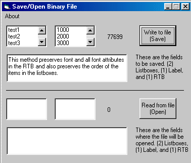



## Binary Save/Open File

### Description

Saves/Opens Binary file. Takes the contents of (2)Listboxes, (1)RTB, and (1)Label and saves to a binary file. Also opens the contents of the binary file into (2)Listboxes, (1)RTB, and (1)Label.
 
### More Info
 
Saves/Opens Binary file. Takes the contents of (2)Listboxes, (1)RTB, and (1)Label and saves to a binary file. Also opens the binary file into (2)Listboxes, (1)RTB, and (1)Label. Email me mds@vci.net for more info.

             |
---                |---
**Submitted On**   |2000-02-28 23:53:50
**By**             |[MethodMan](https://github.com/Planet-Source-Code/PSCIndex/blob/master/ByAuthor/methodman.md)
**Level**          |Intermediate
**User Rating**    |5.0 (20 globes from 4 users)
**Compatibility**  |VB 4\.0 \(32\-bit\), VB 5\.0, VB 6\.0
**Category**       |[Files/ File Controls/ Input/ Output](https://github.com/Planet-Source-Code/PSCIndex/blob/master/ByCategory/files-file-controls-input-output__1-3.md)
**World**          |[Visual Basic](https://github.com/Planet-Source-Code/PSCIndex/blob/master/ByWorld/visual-basic.md)
**Archive File**   |[CODE\_UPLOAD36882292000\.zip](https://github.com/Planet-Source-Code/methodman-binary-save-open-file__1-6320/archive/master.zip)

